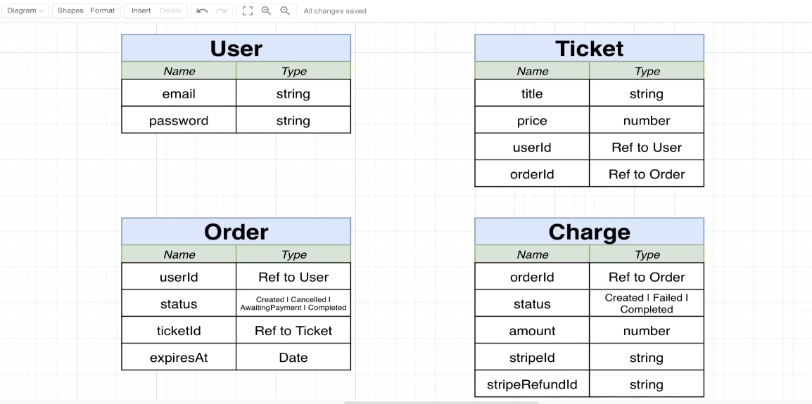
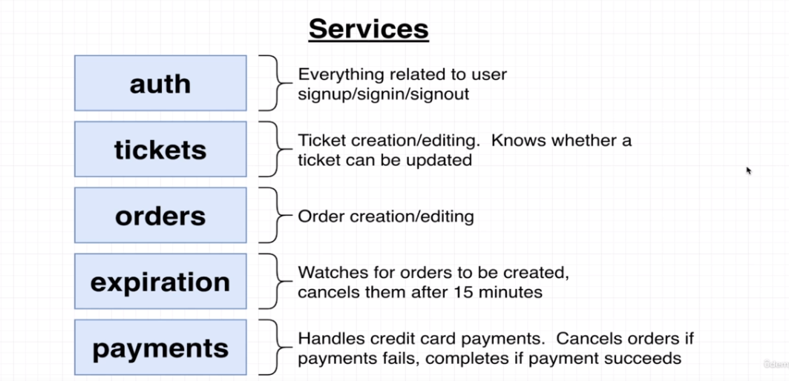
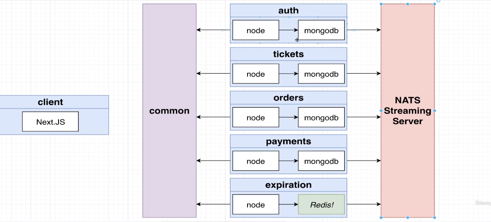

### Resource Type

### Service types

### Event and Architecture Design

## Response Normalization Startefies

Create `rotues` folder and add `current-user.ts`, `signin.ts`, `signout.ts`, `signup.ts`

Add `error-handler.ts` to `middlewares` folder

Add `request-validation-error.ts` and `database-connection-error.ts` to `errors` folder

Add `custom-error` to `errors` folder

## Database Management and Modeling

Add `auth-mongo-depl.yaml` to `k8s`

Connect `mongodb` in `index.ts`

Create user model under `models`

Create `BadRequestError` under `errors`

Create `password.ts` under `services`

Add `userSchema.pre` in `user.ts` to hash password before saving

## Authentication Strategies and options

`npm install cookie-session @types/cookie-session `

set `cookieSession` in `auth/src/index.ts`

**Generating a JWT**

`npm i jsonwebtoken`

use jwt in `routes/signup.ts`

**Creating and accessing Secrets**

`kubectl create secret generic jet-secret --from-literal=JWT_KEY=asffu`

`kubectl get secrets`

Add `env` to `auth-depl`

use `env` in `signup.ts`

add `toJSON` in `user.ts`

Create `validate-request.ts` under `middlewares`

use `validateRequest` in `signin.ts` and `signup.ts`

Finalize `signin.ts`

